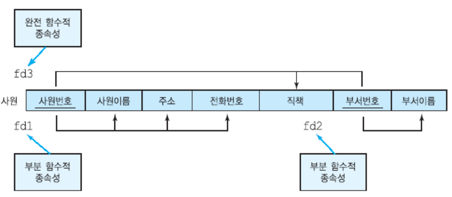
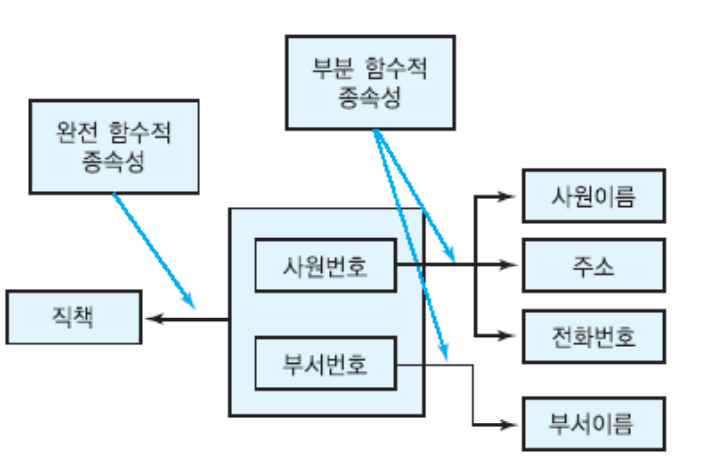
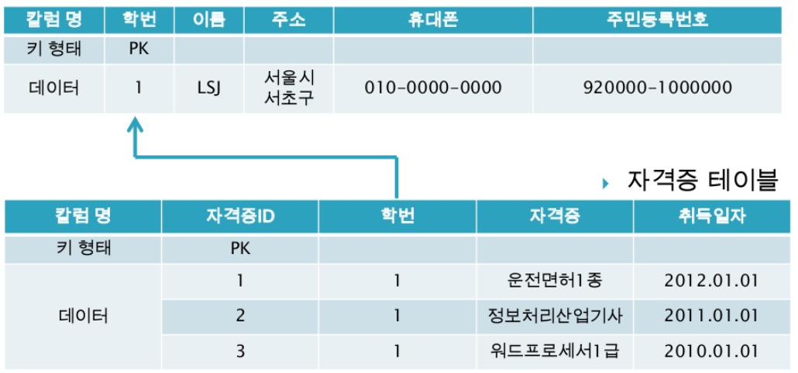

# 정규화

## 1) 정규화(Nomalization)

- 데이터 구조의 안정성을 최대화
- 어떠한 Relation이라도 DB 내에서 표현 가능하도록 한다.
- 데이터 삽입 시 Realtion을 재구성할 필요성을 줄인다.
- 중복을 배제

## 2) 정규화 과정

> 보통 BCNF 정규화까지 진행한다.

## 3) 함수적 종속성(Functional Dependency)

속성들 사이의 관계에 대한 제약조건, A가 B에 결정자이면 B는 A에 함수적으로 종속된다.

ex) Relation이 **(학번, 이름, 과목명)**일 때 `학번`이 결정되면 과목명에 상관없이 학번에는 항상 같은 이름이 대응한다. 학번에 따라 이름이 결정될 때 `학번 → 이름`과 같이 표기한다. (이름이 학번에 함수적으로 종속된다)

`결정자` : 사원번호, 부서번호

**완전 함수적 종속성(FFD: Full Functional Dependency)**

2개의 결정자를 모두 종속하는 경우 완전 함수적 종속성

**이행 함수적 종속성(Transitive Functional Dependency)**

학번 → 지도교수, 지도교수 → 학과일때 학번 → 학과를 만족하는 관계

## 4) Anomaly(이상)의 개념 및 종류

- 삽입 이상 : Relation에 데이터를 삽입할 때 원하지 않는 값들도 함께 삽입되는 현상
- 삭제 이상 : Relation에 데이터를 삭제할 때 관련없는 값들도 함께 삭제되는 현상
- 갱신 이상 : Relation에서 튜플에 있는 속성값을 갱신할 때 일부 튜플의 정보만 갱신되어 정보에 모순이 생기는 현상

## 5) 정규화 과정

- **1차 정규화 (1NF)**

  `반복되는 속성`을 제거한 뒤, Table의 기본 키를 추가해서 새로운 Table을 생성, `NULL값 제거`

  

  

- **2차 정규화 (2NF)**

  Table의 모든 열이 `완전 함수적 종속`을 만족해야 한다.

  

  {**과목코드, 학번}**이 후보 키이다. **{과목코드, 학번} → 등급**, **과목코드 → 과목명, 강의시간** 부분적 종속성이 나타난다. 따라서 두 부분을 Table로 나눈다.

- **3차 정규화 (3NF)**

  `이행적 종속성`을 제거, 기본 키 이외의 다른 열이 다른 열을 결정할 수 없다.

  

  **주문ID가 키본 키**이다. 그런데 회원ID가 회원명, 전화번호, 회원등급을 결정한다.

- **BCNF**

  3차 정규형으로는 해결할 수 없는 이상현상을 해결, **BCNF는 모든 결정자가 후보 키 집합에 속한 정규형**

  

  위 표에서 **{학생, 과목}이 후보 키**이다. 그런데 교수가 과목에 영향을 미친다. 이땐 3차 정규형을 만족하지만 BCNF를 만족하지 않는다. **일반 속성이 후보키를 결정하는 경우**

  **교수 Table**

  

  **수강생 Table**

  

 

**[참고자료]**

[데이터베이스 정규화](https://www.slideshare.net/leeseongje/ss-31382312)

[데이터베이스 정규화 1NF, 2NF, 3NF, BCNF](https://3months.tistory.com/193)
