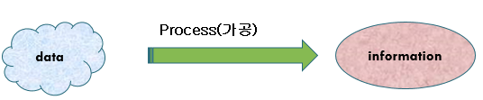
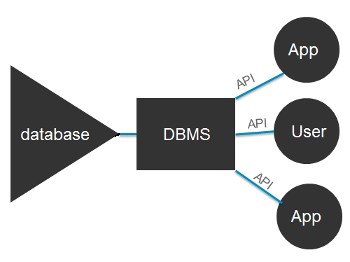
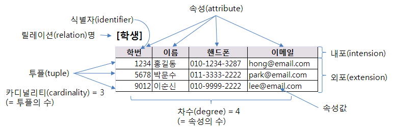

# 데이터베이스 개요

## 1) 데이터베이스 개념

- 자료(Data) : 현실 세계로부터 단순한 관찰이나 측정을 통해 수집된 값
- 정보(Information) : 자료를 처리하여 얻은 결과 (의사 결정을 위한 값

## 2) 데이터베이스 종류

- `일괄 처리 시스템` (Batch Processing System)

  데이터를 한꺼번에 처리, 트랜젝션당 처리비용이 적게든다.

  ex) 급여 계산, 세무 처리

- `분산 처리 시스템`

  분리되어 있는 데이터베이스를 네트워크로 연결해 하나의 시스템인 것처럼 처리

  비싸다

## 3) 데이터베이스

- 데이터베이스의 정의
  - 통합된 데이터
  - 저장된 데이터
  - 운영 데이터
  - 공용 데이터
- 데이터베이스의 특성
  - 실시간 접근성
  - 내용에 의한 참조(Content Reference) → 주소참조
  - 동시 공유(Concurrent Sharing)
  - 계속적 변화

## 4) DBMS

- `종속성`과 `중복성`의 문제를 해결하기 위해서 제안된 시스템
- App과 데이터의 중재자, 모든 APp들이 DB를 공유할 수 있도록 관리

## 5) DBMS 필수기능

- 정의 기능 (Definition Facility)
  - DB 구조 정의
  - 생성, 제거, 수정
- 조작 기능 (Manipulation Facility)
  - DB를 접근하여 데이터 삽입/삭제/갱신 `연산 작업`을 위한 인터페이스 제공
- 제어 기능 (Control Facility)
  - 데이터 무결성 유지
  - 보안 유지, 권한 검사

## 6) 스키마

데이터 베이스 개체(Entity), 속성, 관계(Relation)에 대한 정의

## 7) 스키마 3계층

- `외부 스키마` (External Schema) : 사용자관점, SQL, App
- `개념 스키마` (Conceptual Schema) : DB구조를 논리적으로 정의
- `내부 스키마` (Internal Schema) : 데이터의 실제 저장 위치

## 8) 데이터베이스 언어

- 데이터 정의어 (`DDL` - Data Definition Language)

  CREATE, ALTER, DROP

- 데이터 조작어 (`DML` - Data Manipulation Language)

  SELECT, INSERT, DELETE, UPDATE

- 데이터 제어어 (`DCL` - Data Control Language)

  데이터 보안, 무결성

## 9) 데이터 모델의 구성 요소

- 개체 (Entity) : DB를 표현하는 유형
- 속성 (Attribute) : 개체의 특성을 나타내는 항목
- 관계 (Relation) : 개체간의 관계
- 레코드 (Record) : Table의 row
- 튜플 (Tuple) : 레코드와 똑같다.
- 도메인 (Domain) : 한 속성에 나타낼 수 있는 값들의 집합
- 차수 (Degree) : Table에 있는 속성의 수
- 카디널리티 (Cardinality) : 튜플의 수

## 10) 키의 개념 및 종류

1. **슈퍼 키(Super Key)**

    Table에서 row를 고유하게 식별할 수 있는 속성들의 집합

    `유일성`은 만족하나 `최소성`은 만족하지 않는다.

    ex) 학번 + 주민등록번호, 전화번호 + 학번

2. **후보 키(Candidate Key)**

    슈퍼 키 중에 더이상 줄일 수 없는 형태이다. 

    모든 Relation은 반드시 하나 이상의 후보키를 가져야 한다.

    `유일성`, `최소성`을 만족해야한다.

    ex) 학번, 주민등록번호 

3. **기본 키(Primary Key)**

    후보 키 중에 선택된 것, 기본 키로 Relation에서 Tuple을 구분해낼 수 있다. (NOT NULL)

    중복된 값을 가질 수 없다.

4. **외래 키(Foreign Key)**

    어떤 Relation의 기본 키를 참조하는 속성 값

    DB에서 Relation간의 관계를 나타내기 위해 사용한다.

> 유일성 : 하나의 키로 어떤 Tuple을 바로 찾아낼 수 있는 것

## 11) 무결성 제약조건

- 개체 무결성 : Relation에서 기본 키를 구성하는 속성은 NULL 값을 가질 수 없다.
- 참조 무결성 : Relation은 참조할 수 없는 외래 키 값을 가질 수 없음
- 도메인 무결성 : 특정 속성의 값이 그 속성이 정의된 도메인에 속한 값이어야 한다.
